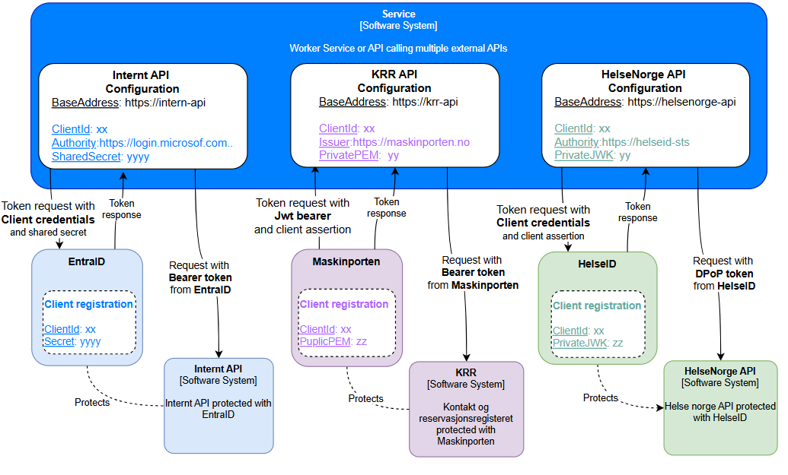

# Server to server (M2M)
## Introduction
Server-to-server authentication (also called machine to machine or app to app) is used for integrations between applications where no user is present. 

Modern applications often need to interact with multiple external APIs, each with distinct authentication and authorization requirements. APIs can be protected with different Autorization Servers (or an OpenID Connect Provider) as illustrated below. The illustration show an API integrating with three APIs that use different OAuth 2.0 flows (authentication flow and authorization grants):

- **HelseNorge API protected with HelseID:** Uses client credential flow with client assertion for authentication. Requires enhanced security using client assertion and Demonstrating Proof of Possession (DPoP)
- **KRR protected with Maskinporten:** Uses Jwt bearer grant with client assertion for authentication
- **Intern API protected with EntraID:** Uses client credential flow with shared secret approach for client authentication

## Server to server (M2M) authorization grants

There are mainly two common flows that can be used for getting an OAuth 2 access token.

- **Client credentials authorization grant:** This flow is described in [RFC6749 section Client Credentials grant](https://datatracker.ietf.org/doc/html/rfc6749#section-4.4) also see [Duende documentation on machine-to-machine communication](https://docs.duendesoftware.com/identityserver/tokens/requesting#machine-to-machine-communication). Also see [Duende Client Credentials library](https://docs.duendesoftware.com/accesstokenmanagement/advanced/client-credentials/)

- **JWT-bearer authorization grant:** This flow is described in [Maskinporten protocol](https://docs.digdir.no/docs/Maskinporten/maskinporten_protocol_jwtgrant) spescified can be found in 
[RFC7523](https://datatracker.ietf.org/doc/html/rfc7523)

## Useful guides and samples

- [Delegation handler blog from duende](https://duendesoftware.com/blog/20250902-dotnet-httpclient-and-delegating-handlers)
- [Http message handlers](https://learn.microsoft.com/en-us/aspnet/web-api/overview/advanced/http-message-handlers)
- [Options pattern](https://learn.microsoft.com/en-us/aspnet/core/fundamentals/configuration/options?view=aspnetcore-9.0)
- [Duende foss libraries](https://github.com/DuendeSoftware/foss)
and [Duende.AccessTokenManagement](https://github.com/DuendeSoftware/foss/tree/main/access-token-management)

