# Security middlewares

## Authentication and authorization middleware

- Authentication = "Who are you?" (identification)
- Authorization = "What can you do?" (permission/access control checking)

Authentication middleware always runs first and populates user context based on request authentication scheme and Authorization middleware only runs when policies are applied to endpoints.

```mermaid
flowchart TD
    A[Incoming HTTP Request] --> B[AuthenticationMiddleware<br/>📋 Checks authentication scheme<br/>👤 Populates HttpContext.User<br/>🔍 Validates credentials]
    B -->|No valid credentials| C[HttpContext.User is empty/unauthenticated]
    B -->|Valid credentials| D[HttpContext.User is authenticated]
    
    C --> E[AuthorizationMiddleware<br/>📋 Checks global policy requirements<br/>📋 Checks endpoint policy requirements]
    D --> E[AuthorizationMiddleware<br/>📋 Checks global policy requirements<br/>📋 Checks endpoint policy requirements]
    
    E --> F[PolicyEvaluator.AuthorizeAsync]
    
    F -->|Policy has DenyAnonymousAuthorizationRequirement<br/> AND user not authenticated| G[Return Challenge]
    G --> H[ChallengeAsync] --> I[Response: 401 Unauthorized]
    
    F -->|Policy has other requirements AND<br/> user authenticated but requirement fails| J[Return Forbid]
    J --> K[ForbidAsync] --> L[Response: 403 Forbidden]
    
    F -->|All requirements succeed| M[AuthorizationResult.Success]
    M --> N[Controller/Endpoint executes]
    
    %% Styling
    classDef middleware fill:#e3f2fd,stroke:#1976d2,stroke-width:2px
    classDef userState fill:#f3e5f5,stroke:#7b1fa2,stroke-width:2px
    classDef decision fill:#fff3e0,stroke:#ef6c00,stroke-width:2px
    classDef success fill:#e8f5e8,stroke:#2e7d32,stroke-width:2px
    classDef error fill:#ffebee,stroke:#d32f2f,stroke-width:2px
    classDef controller fill:#e1f5fe,stroke:#0277bd,stroke-width:2px
    
    class B,E middleware
    class C,D userState
    class F decision
    class M,N success
    class G,H,I,J,K,L error
    class A controller
```

### 🎫 Authentication Middleware

**Purpose:** Identifies who the user is

- Runs on every request
- Examines credentials (JWT tokens, cookies, certificates)
- Populates HttpContext.User with identity information
- Never blocks requests - just sets user context (authenticated or anonymous)

### 🚪 Authorization Middleware

**Purpose:** Determines what the user can access

- Only enforces policies when [Authorize] attributes or fallback policies are present
- Evaluates authorization requirements (roles, claims, custom policies)
- Returns 401 if user needs to authenticate, 403 if authenticated but denied access
- Allows anonymous access when no authorization is required
