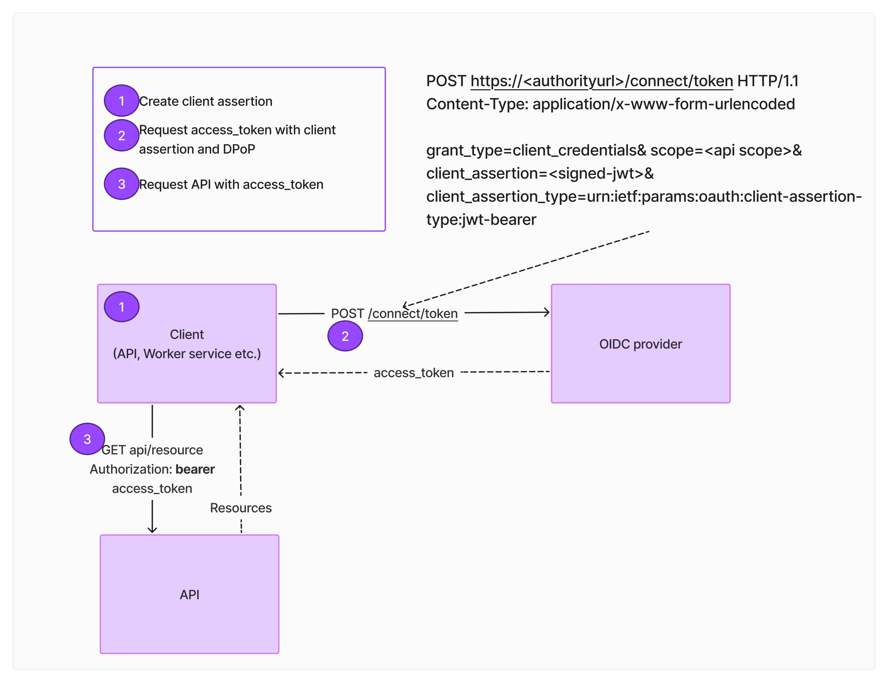
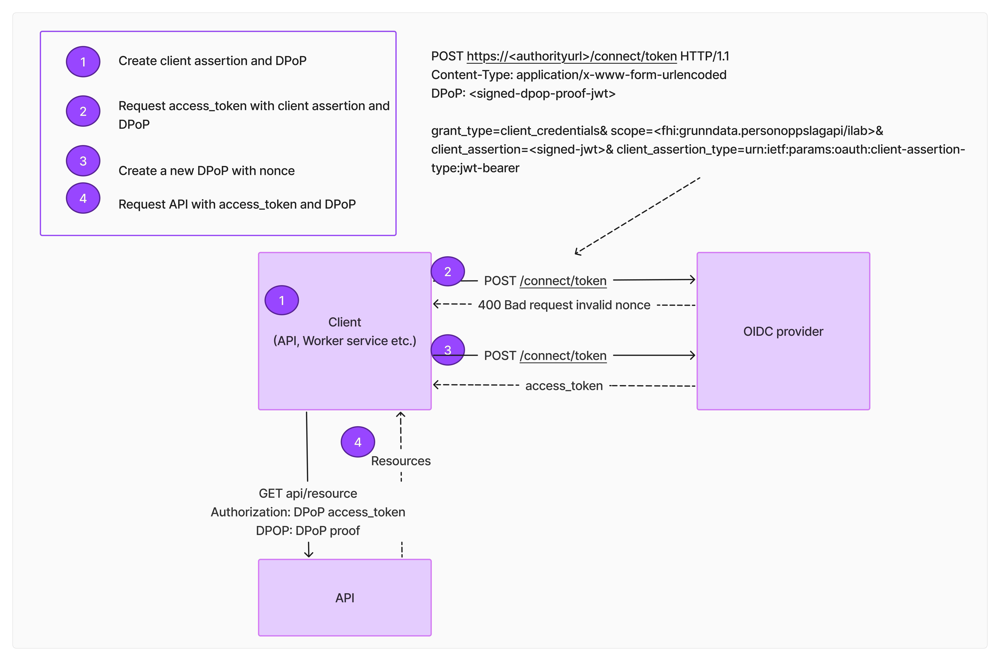

# Manual token request 

## Bearer token request flow

Below is sample of client credential request for bearer token. It sends a POST request to the token endpoint with the required parameters (`grant_type`, `client_id`, `client_secret`, and `scope`). The response contains the access token, which can be used to authenticate API requests.

### Code Sample
See the code lab for a working example [Bearer token request](../../code-lab/client-credentials/manual-bearertoken-request.ipynb)

## DPoP request flow

Sample of DPoP request below

### Code Sample
See the code lab for a working example [DPoP token request](../../code-lab/client-credentials/manual-dpoptoken-request.ipynb)
