# Service calling multiple external APIs

Modern applications often need to interact with multiple external APIs, each with distinct authentication and authorization requirements. This architectural pattern demonstrates how a single worker service can securely communicate with different APIs using their respective authentication mechanisms.

## Authentication Scenarios
The example below showcases a worker service integrating with two APIs that use different OAuth 2.0 flows:

- **API 1 protected with HelseID:** Requires enhanced security using client assertion and Demonstrating Proof of Possession (DPoP)
- **API 2 protected with Duende IdentityServer:** Uses the simpler shared secret approach for client authentication

```mermaid
flowchart TB
    subgraph WS ["Worker Service"]
        W([Background Worker])
        
        subgraph HC1 ["HttpClient API 1"]
            C1["Configuration📋<br/> Authority: HelseID  <br/> Secret: Shared secret <br/>ClientID:xxx <br/> TokenEndpoint: helseid.no/token "]
            C2["API client 1<br/>BaseAddress: api1.no<br/>"]
        end
               
        subgraph HC2 ["HttpClient API 2"]
            C3["Configuration📋<br/> Authority: Duende  <br/> Secret: Shared secret <br/>ClientID:xxx <br/> TokenEndpoint: duende.com/token "]
            C4["API client 2<br/>BaseAddress: api2.no<br/><br/>  "]
        end
      
        
        W --> HC1
        W --> HC2
    end
    
     
        A1[[🏛️ HelseID Authority]]
        API1((🌐API 1))
        A1 -.->|protects| API1
        A2[[🏛️ Duende IdentityServer]]
        API2((🌐 API 2))
        A2 -.->|protects| API2
   
    
    %% Authentication flows
    HC1 -->| Request token with <br/>ClientID + Client Assertion| A1
    A1 -->| access_token| HC1
    HC1 -->| Bearer access_token| API1
    
    HC2 -->|Request token with<br/>ClientID + Secret| A2
    A2 -->|access_token| HC2
    HC2 -->|Bearer access_token| API2
    
    %% Styling
    classDef worker fill:#fff5e6,stroke:#d2691e,stroke-width:2px;
    classDef httpClient fill:#e6f3ff,stroke:#0066cc,stroke-width:2px;
    classDef authority fill:#f0f8ff,stroke:#1e90ff,stroke-width:2px;
    classDef api fill:#f0fff0,stroke:#228b22,stroke-width:2px;
    classDef ecosystem fill:#f9f9f9,stroke:#999,stroke-width:1px,stroke-dasharray: 3 3;
    classDef workerService fill:#fff8dc,stroke:#b8860b,stroke-width:2px,stroke-dasharray: 2 2;
    
    class W worker;
    class C1,C2 httpClient;
    class A1,A2 authority;
    class API1,API2 api;
    class G1,G2 ecosystem;
    class WS workerService;
```

## Code sample

See code sample in [Fhi.Samples.WorkerServiceMultipleClients]() project. 
