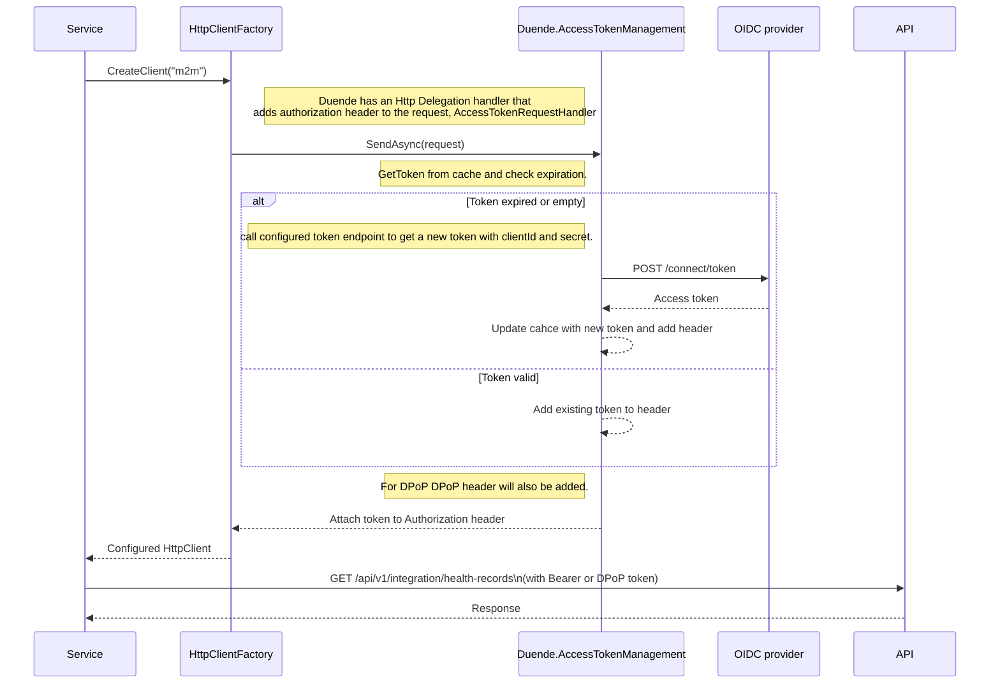
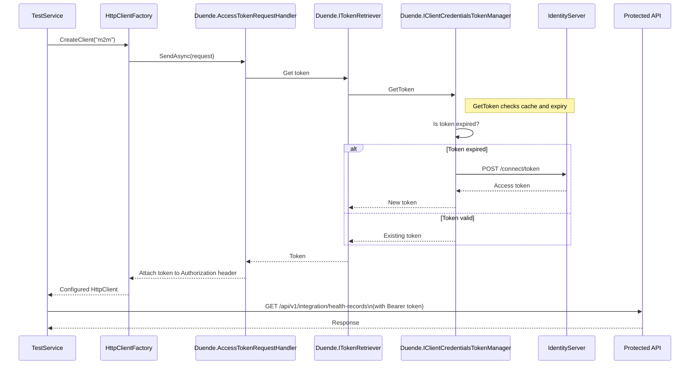

# Client credentials token request from a Web host

In ASP.NET Core applications, you can securely call downstream APIs using `IHttpClientFactory` together with Duende's `AccessTokenRequestHandler`. This approach ensures that access tokens are automatically managed and refreshed when needed.

## Code Sample
See the code lab for a working example: [Call API from Web server host using IHttpClientFactory and Duende AccessTokenManagement](../../code-lab/client-credentials/webserver-host-sample.ipynb)

## Flow Description
The diagrams below show how an `HttpClient` created by `IHttpClientFactory` uses Duende's token management to attach and refresh access tokens when calling a protected API.

- *The simplified diagram* shows the main steps token retrieval, cache/expiration check, and API call.
- *The detailed diagram* breaks down the internal calls between Duende components.

**Simplified API call sequence with Duende.AccessTokenManagement**

**Detailed API call sequence with Duende.AccessTokenManagement**

